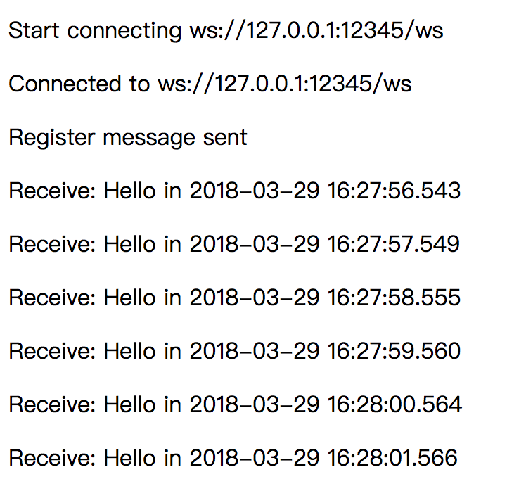

# wserver

[](https://www.travis-ci.org/alfred-zhong/wserver) [](https://godoc.org/github.com/alfred-zhong/wserver) [](https://goreportcard.com/report/github.com/alfred-zhong/wserver)

Package for setup websocket server with message push

> This package is still not stable and not recommended to be used in production.

## Basic Usage

Try to start a wserver, you just need to write like this.

### Start wserver

```go
server := wserver.NewServer(":12345")
if err := server.ListenAndServe(); err != nil {
    panic(err)
}
```

Now wserver listens on port: 12345.

### Browser connecting

Now browser can connect to `ws://ip:12345/ws`. After connection established, browser should send a message to register. Register message looks like this.

```json
{
    "token": "03A3408D-3BD4-4C6C-BDC7-8596E6D31848",
    "event": "whatever-it-interested"
}
```

The `token` is used for identification and `event` means what kind of messages the client interested (Like topic in MQ). 

### Push messages

Now you can send a request to `http:/ip:12345/push` to push a message. Message should look like this.

```json
{
    "userId": "03A3408D-3BD4-4C6C-BDC7-8596E6D31848",
    "event": "whatever-it-interested",
    "message": "Hello World"
}
```

The `userId` is equal to token is not specified (customize by using `server.AuthToken`). The `event` is equal to that above and `message` is the real content will be sent to each websocket connection.

## Example

The server code:

```go
func main() {
	server := wserver.NewServer(":12345")

	// Define websocket connect url, default "/ws"
	server.WSPath = "/ws"
	// Define push message url, default "/push"
	server.PushPath = "/push"

	// Set AuthToken func to authorize websocket connection, token is sent by
	// client for registe.
	server.AuthToken = func(token string) (userID string, ok bool) {
		// TODO: check if token is valid and calculate userID
		if token == "aaa" {
			return "jack", true
		}

		return "", false
	}

	// Set PushAuth func to check push request. If the request is valid, returns
	// true. Otherwise return false and request will be ignored.
	server.PushAuth = func(r *http.Request) bool {
		// TODO: check if request is valid

		return true
	}

	// Run server
	if err := server.ListenAndServe(); err != nil {
		panic(err)
	}
}
```

If you want to run a demo. Then follow the steps below:

* Go to **_examples/server** and run `go run main.go` to start a wserver.
* Open the webpage **_examples/index.html** in the browser.
* Go to **_examples/push** and run `go run main.go` to send some messages.

If all success, you will see the content like this:



## PS

Package is still not stable and I will improve it then. 

PRs will be welcomed. 🍺
